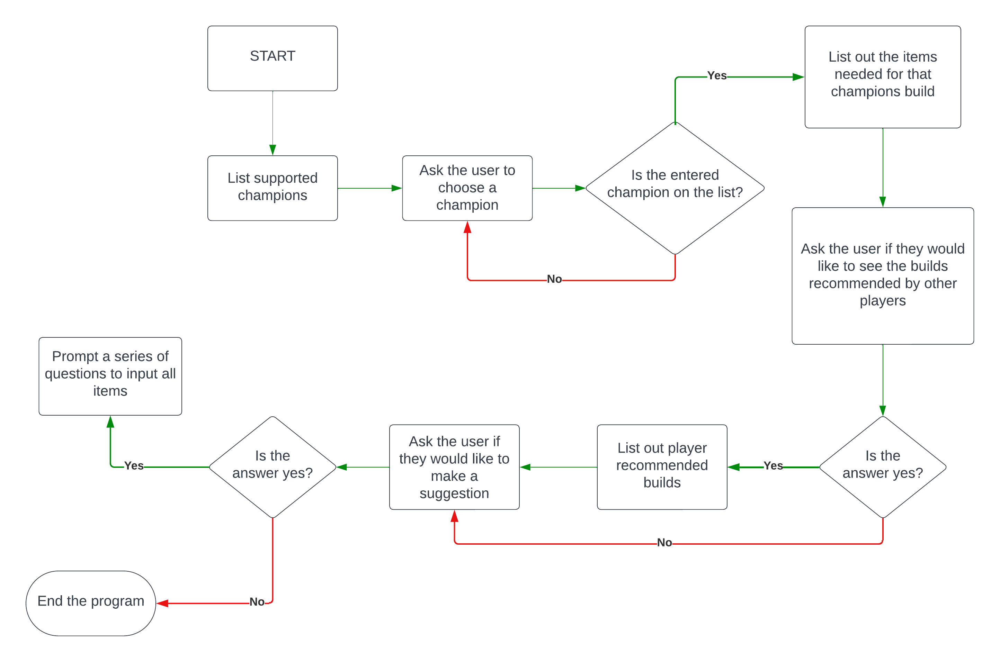
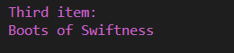

# League of Legends Champion Build Library

League of Legends Champion Build Library is a Python terminal game, which runs in the Code Institute mock terminal Heroku. 

Users can choose a champion out of a list of supported ones which will then give them a list of items to use in the game. They can also view what other players have suggested to use and they can even make their own suggestions if they wish to do so.

You can view the live site [here](https://league-of-legend-build-library-eae49736bdd9.herokuapp.com/)

# How to use

The program will give the user a list of supported champions.

The user will then put in the name of the champion that they wish to see the build for.

Upon receiving the list of items the user will be prompted with an option of viewing the list of items that other players have suggested to use.

If the user has answered yes to that then they will see a list printed in the terminal for them.

If they choose to view it or not either way they will be prompted with another question that will ask them if they want to make their own suggestion.

If they wish to do so then they will be asked to input the name of the champion they want to make a suggestion for and each item separetly.

If they choose not to then the program will say goodbye to them and end the program.

# User Stories 

- As a user I want to easily understand the purpose of the program
- As a user I want to learn something new
- As a user I want to be able to make a suggestion
- As a user I want to be able to view other players suggestions 

# Design

## Flowchart:

## Wireframes

## 1

## 2

## 3

## 4

# Features

- Welcome Screen - the user gets presented with a list of available champions where they have to choose one.

- Champion Build - the user gets an item build list for a selected champion.

- Other Players Recommendations - the user gets an option to see other players recommendations.

- Submitting Recommendation - the user gets an option of making their own submission for a player build.

- User Input - the user will be asked to make their own recommendation and if they choose to make their own recommendation then they can start inputing their own champion and item names.

- Invalid inputs - to be sure that the user provided  the correct input. For any invalid input, the error message will appear. 

* Sorry please enter only one of the available champions exactly as they are written.
* Please accept our sincerest aplogoies, there seems to have come to an issue.

# Issues and Bugs
 - Error message line too long
    - I fixed the error by splitting the string into two lines
 - Not showing all user recommended builds from google sheets
    - I fixed this by removing the return value from inside the for loop to outside of it

# Technologies Used
- Languages 
    - Python

# Testing
## Validators
The [Pycodestyle Validator](https://pypi.org/project/pycodestyle/) and [Python Code Checker](https://extendsclass.com/python-tester.html) were used to check my code for syntax errors in this project.

- Manually tested user inputs by purposefully inputing incorrect data to confirm error messages where capturing wrong inputs

- Tested in the local terminal and on the mock terminal on the deployment site on Heroku 

# Deployment 
### The project was deployed using Code Institute mock terminal for Heroku.

### Steps to deploy:
- Fork or clone this repository
- Ensure the Procfile is in place
- Create a new app in [Heroku](https://id.heroku.com/login)
- Select "New" and "Create new app"
- Name the new app and click "Create new app"
- In "Settings" select "BuildPacks" and select Python and Node.js
- While still in "Settings", click "Reveal Config Vars" and input the following. KEY: PORT, VALUE: 8000. Nothing else is needed here as this project does not have any sensitive files.
- Click on "Deploy" and select your deploy method and repository.
- Click "Connect" on selected repository.
- Either choose "Enable Automatic Deploys" or "Deploy Branch" in the manual deploy section.
- Heroku will now deploy the site.

# Credits

- [Code Institute](https://codeinstitute.net/) for the mock terminal for the deploy to a live site.
- [Hangman-youtube-tutorial Kite](https://www.youtube.com/watch?v=m4nEnsavl6w) inspiration on how to build a hangman game. 
- [ASCII Art Generator](https://patorjk.com/software/taag/#p=display&f=Standard&t=Hangman) for creating word art for game title.
 